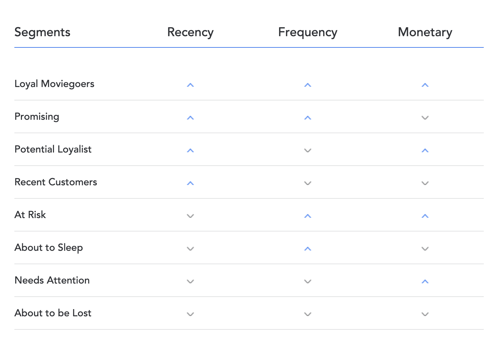

# TIỀN XỬ LÝ DỮ LIỆU VÀ XÂY DỰNG MÔ HÌNH RFM PHÂN KHÚC KHÁCH HÀNG
Dựa trên tập dữ liệu của cuộc thi Data Got Talent 2023, chúng em tiến hành tiền xử lý dữ liệu và phân khúc khách hàng theo 8 nhóm dựa trên các chỉ số RFM
## Nội dung
* [Giới thiệu](#gioithieu)
* [Thư viện và Api sử dụng](#thuvienvaapi)
* [Mô tả các bước thực hiện](#Các bước thực hiện)
## Giới thiệu
Thông tin của bộ dữ liệu được nhận bao gồm 1 file excel trong đó có 3 sheet chứa dữ liệu và 1 sheet mô tả bộ dữ liệu.
- Bảng dữ liệu customer chứa thông tin của khách hàng, bao gồm 4479 khách hàng và 7 trường thông tin
- Bảng dữ liệu ticket chứa thông tin giao dịch của khách hàng, bao gồm 35474 giao dịch và 15 trường thông tin
- Bảng dữ liệu phim chứa thông tin phim, bao gồm 60 phim và 10 trường thông tin
Dựa trên thông tin bộ dữ liệu được cho chúng em thực hiện tiền xử lý dữ liệu và xây dựng phân tập khách hàng.
## Thư viện và Api sử dụng
Chúng em sử dụng các thư viện như là:
* pandas version: 2.0.3, là thư viện phổ biến dùng để thao tác trên các dữ liệu dạng bảng.
* themoviedb version: 0.4.0, là thư viện dùng thao tác với api [TMDB](https://developer.themoviedb.org/docs/wrappers-and-libraries).
* thefuzz version: 0.22.1, là thư viện dùng để so sách độ tương đồng dữ các chuỗi kí tự.
* imdby version: 0.1.5, cũng là một thư viện chưa dữ liệu về phim
* numpy version: 1.24.3, là một dùng để xử lý dữ liệu list
* seaborn version: 0.12.2, sử dụng để vẽ biểu đồ
* matplotlib version: 3.7.2, sử dụng để vẽ biểu đồ
* googletrans version: 3.1.0a0, sử dụng để dịch
## Mô tả các bước thực hiện
### Tiền xử lý dữ liệu:
Các bảng như là customer và ticket xử lý các dữ liệu bị thiếu cho các trường dữ liệu phân loại, text và kiểm tra xem dữ liệu có bị trùng lặp hay không
Còn đối với bảng film:
- Xử lý các dữ liệu bị thiếu bằng thư viện imdby và thư viện themoviedb đều là các thư viện chưa thông tin phim từ các nguồn như IMDB, netflix, ...
```python
film=fill_film_data_missing(film)
film=fill_missing_by_cinemagoer(film)
```
- Dựa trên dữ liệu hiện có trong bảng film, các thông tin phim không đúng so với các phim trong bảng ticket, nên chúng em thực hiện lấy thêm thông tin phim thông qua api [TMDB](https://developer.themoviedb.org/docs/wrappers-and-libraries), dựa trên trường tên phim sau khi được loại bỏ các kí tự thừa trong bảng ticket.

```python
for title in ticket.title_clean.unique():
    dict_temp = get_film_data_missing(title)
    if (dict_temp != np.nan) | (dict_temp!={}):
        if dict_temp['title'] not in film.title:
            film.loc[len(film)] = dict_temp
            ticket.loc[ticket.title_clean == title,'show_id'] = dict_temp['show_id']
    else:
        print(title)
```
### Phân khúc khách hàng RFM:
Phân khúc khách hàng dựa trên các chỉ số:
- Recency: Hành vi xem phim trên rạp chiếu phim của khách hàng dựa trên ngày xem phim gần đây nhất của họ và số ngày họ không hoạt động kể từ lần xem cuối cùng.
- Frequency: Hành vi mua vé xem của khách hàng dựa trên số lần họ mua vé xem phim từ rạp chiếu phim.
- Monetary Value/Revenue: Hành vi mua vé của khách hàng dựa trên doanh thu họ tạo ra.

Trong [mô hình RFM của Movio](https://vistagroup.co.nz/blog/rfm-the-triple-threat-designed-to-increase-high-value-moviegoers), người xem phim được phân loại theo lần xem gần đây, tần suất và mức chi tiêu trung bình của họ. Sau đó, chúng được phân đoạn theo việc chúng nằm trên hay dưới giá trị trung bình cho mỗi thuộc tính, theo bảng sau:


Các mức trung bình được chọn cho mô hình này nhằm cung cấp số liệu ổn định, không biến động mà nhờ đó chúng tôi có thể nắm bắt được sự phát triển hành vi của thành viên trên tất cả các phân khúc. Các mức trung vị cũng đảm bảo sự phân bổ đồng đều lượng người xem phim trên tất cả tám phân khúc, mỗi phân khúc nắm bắt đặc điểm và hành vi của người xem phim một cách độc đáo.
Cuối cùng là thông tin của từng nhóm khách hàng:
1. Loyal moviegoers - Những người xem phim trung thành: những người đã đến rạp gần đây, thường xuyên ghé thăm và chi tiêu nhiều.
2. At risk - Có nguy cơ: đây là những người xem phim thường xuyên đến rạp và chi tiêu rất nhiều nhưng gần đây chưa ghé thăm
3. Potential loyalist - Người trung thành tiềm năng: những người xem phim này gần đây đã đến rạp và chi tiêu rất nhiều nhưng không thực sự đi thường xuyên
4. Needing attention - Cần được chú ý: những người xem phim này chi tiêu rất nhiều mỗi lần họ đến rạp của bạn nhưng không làm điều đó thường xuyên và gần đây không đến xem
5. Promising - Đầy hứa hẹn: những người xem phim này gần đây đã đến rạp chiếu phim và tham dự thường xuyên nhưng không chi tiêu nhiều khi họ đến rạp
6. Recent customers - Khách hàng gần đây: những người xem phim này gần đây đã đến rạp nhưng không đến thường xuyên và không chi tiêu nhiều
7. About to sleep: đây là những khán giả thường xuyên đến rạp nhưng gần đây không đến xem và không chi tiêu nhiều
8. About to be lost: đây là những khán giả ít giá trị nhất, những người gần đây không đến rạp, không đến thường xuyên và cũng không chi tiêu nhiều